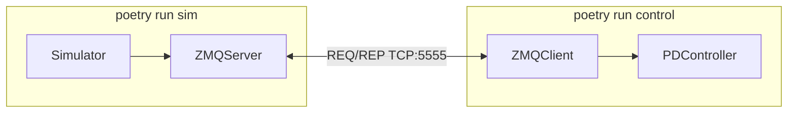

# 2D Манипулятор в MuJoCo

Симуляция двухзвенного мобильного манипулятора в MuJoCo с PD-контроллером для задачи pick-and-place. Симулятор и контроллер работают в отдельных процессах и обмениваются данными через ZeroMQ (REQ/REP).

## Архитектура



1. **Симулятор** (`poetry run sim`) — MuJoCo-среда, ZMQ REP-сервер на порту 5555.
2. **Контроллер** (`poetry run control`) — PD-контроллер, ZMQ REQ-клиент.

Протокол обмена:
- Клиент → Сервер: `{'action': np.ndarray(5,)}` — моменты суставов + скорость базы
- Сервер → Клиент: `{'obs', 'eef_pos', 'obj_pos', 'goal', 'grasped'}`

## Требования

- Python 3.11+
- [Poetry](https://python-poetry.org/docs/#installation)

## Установка

```bash
git clone <url-репозитория>
cd manipulator_2d
poetry install
```

## Запуск

Откройте **два терминала** в корне проекта.

**Терминал 1 — симулятор:**
```bash
poetry run sim
```

**Терминал 2 — контроллер:**
```bash
poetry run control
```

Симулятор откроет окно MuJoCo viewer. Контроллер подключается к симулятору и управляет манипулятором: подъехать к объекту → захватить → доставить к цели.

## Тесты

```bash
poetry run pytest
```

С покрытием:
```bash
poetry run pytest --cov=manipulator_2d --cov-report=term-missing
```

## Структура проекта

```
manipulator_2d/
├── pyproject.toml          # Poetry: зависимости и скрипты
├── poetry.lock
├── README.md
├── .github/workflows/ci.yml
├── tests/
│   ├── conftest.py
│   ├── test_kinematics.py
│   ├── test_pd_controller.py
│   ├── test_simulator.py
│   └── test_zmq_bridge.py
└── src/manipulator_2d/
    ├── cli.py              # Точки входа sim / control
    ├── constants.py        # Общие константы
    ├── config/robot.xml    # MuJoCo-модель
    ├── simulator/          # Среда и кинематика
    ├── controller/         # PD-контроллер
    └── communication/      # ZMQ-мост
```

## Зависимости

| Пакет | Назначение |
|-------|------------|
| `numpy` | Математика, векторы наблюдений |
| `mujoco` | Физическая симуляция |
| `pyzmq` | Межпроцессное взаимодействие |

## CI

GitHub Actions запускает тесты на Python 3.11 и 3.12 при каждом push и pull request в ветки `main` / `master`.
